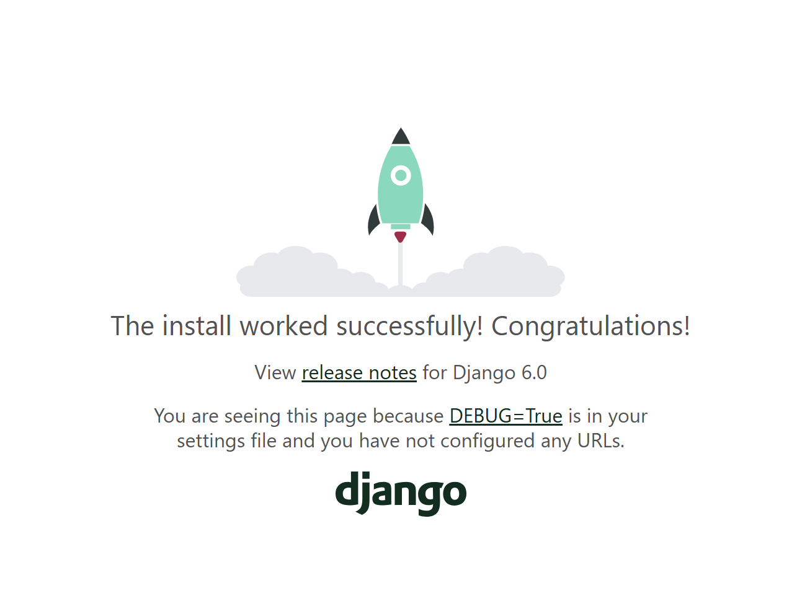
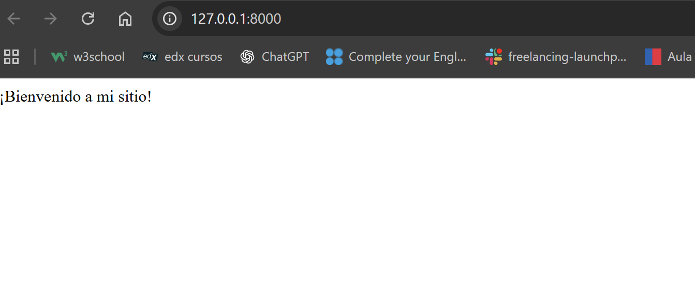

1.  
Paso 1: python m- venv venv 

Se crea un ambiente virtual dentro de la carpeta donde se ejecuta.

paso 2: venv\Script\activate

Se activa el entorno virtual

Paso 3: pip install django

Se instala djando en entorno virtual

PIP es el repositorio donde se almacenan todas las bilbliotecas de python.

Djando al ser instalado dentro de un entorno virtual queda encapsulado, en dicho entorno con las versiones de bilbiotecas que posee,. Es más fácil manejarlo, y se puede controlar de mejor manera posibles actualizaciones.

2.

Se crea el proyecto:

django-admin startproject entorno_config_django

C:.
│   db.sqlite3
│   manage.py
│
├───configuracion
│   │   admin.py
│   │   apps.py
│   │   models.py
│   │   tests.py
│   │   views.py
│   │   __init__.py
│   │
│   └───migrations
│           __init__.py
│
└───entorno_config_django
    │   asgi.py
    │   settings.py
    │   urls.py
    │   wsgi.py
    │   __init__.py
    │
    └───__pycache__
            settings.cpython-312.pyc
            urls.cpython-312.pyc
            wsgi.cpython-312.pyc
            __init__.cpython-312.pyc

manage.py:

Es el archivo de control principal del proyecto Django.

__init__.py:

Esto le dice a python que esta carpeta debe tratarse como un paquete de python. Con esto python puede importar cosas desde esta carpeta.

settings.py:

Configuración general del proyecto.

urls.py:

sirve para definir las rutas o direcciones web del proyecto

asgi.py:

Asynchronous Server Gateway Interface. se usa para cosas más modernas. soporta async

wsgi.py:
Web Server Gateway Interface. Sirve para desplegar django en los servidores.

asgi y wsgi son como puertas de entrada para que el serrvidor levante la app

3. Captura de pantalla de  prueba:

4. crear apicación:

python manage.py startapp  configuracion

En django, cada desarrollo en un proyecto, este proyecto está compuedo de aplicaciones, cada una de ellas le entrega una funcionalidad distinta.

Las principales carpetas dentro de la app principal es
migrations y los archivos: init, admin, apps, models, test, views 

5.

5.1 Cuando agregas:

'configuracion',

dentro de INSTALLED_APPS, le estás diciendo a Django:

“esta app forma parte del proyecto y quiero que Django la tenga en cuenta”.

Eso hace que Django:

-la reconozca como app instalada
-busque sus archivos importantes
-pueda considerar sus modelos, vistas, admin, migraciones, etc.

Sin eso, la app existe como carpeta en Python, pero Django no la incorpora formalmente a su funcionamiento.

5.2 
Cambio en configuracion/views.py

Cuando escribes algo como:

from django.http import HttpResponse

def inicio(request):
    return HttpResponse("¡Bienvenido a mi sitio!")

estás creando una vista.

Esa vista es una función que:

recibe una petición del navegador (request)

devuelve una respuesta (HttpResponse)

En este caso, la respuesta es simplemente el texto:

¡Bienvenido a mi sitio!

O sea, aquí defines qué contenido devuelve tu app cuando alguien entra a cierta URL.

5.3

Cambio en configuracion/urls.py

Cuando escribes algo como:

from django.urls import path
from . import views

urlpatterns = [
    path('', views.inicio, name='inicio'),
]

estás creando el archivo de rutas de la app.

Ese cambio hace que Django sepa:

que existe una ruta '' dentro de esta app

y que esa ruta debe ejecutar views.inicio

El '' significa:

la ruta vacía

o sea, la raíz de lo que le corresponda a esta app

Entonces este archivo cumple el rol de decir:

“si entran a esta ruta, usa esta vista”.

4.4
4) Cambio en entorno_config_django/urls.py

Cuando agregas algo como:

from django.urls import path, include

y luego:

path('', include('configuracion.urls')),

estás conectando las rutas de la app al proyecto principal.

Esto hace que el proyecto diga:

“cuando entren a la raíz del sitio, revisa las rutas que están dentro de configuracion/urls.py”.

include() sirve justamente para delegar rutas a otra app.

Entonces este cambio no define la respuesta directamente, sino que le dice al proyecto principal:

“las rutas de esta parte del sitio están en la app configuracion”.
